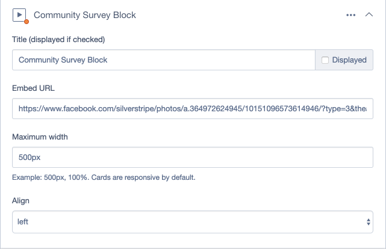
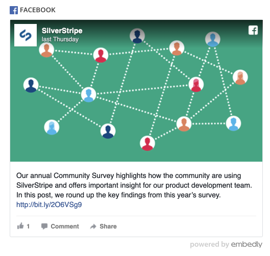

# Elemental Embed.ly Block

[](https://travis-ci.org/chillu/silverstripe-elemental-embedly-block)
[](https://scrutinizer-ci.com/g/chillu/silverstripe-elemental-embedly-block/?branch=master)
[](https://codecov.io/gh/chillu/silverstripe-elemental-embedly-block)

Allows embedding of various videos, images, rich media and social elements
as a content block via [silverstripe-elemental](https://github.com/dnadesign/silverstripe-elemental).




It supports 500+ services through the [Embed.ly](https://embed.ly/) service,
incl. Facebook, YouTube, Instagram, Twitter, Google Maps, New York Times, and many more.
You can [try it out](https://embed.ly/code) yourself.

Examples:

 * Display a video player
 * Show a Facebook post incl. "like" buttons
 * Share a magazine article with the headline image
 * Point to a business or a location in an interactive Google Map

Note: The Embed.ly service is ad supported on the free plan.
For customisations and an ad-free display, you'll need a paid plan.

## Installation

Install using Composer:

```
composer require chillu/silverstripe-elemental-embedly
```

Once complete, run `dev/build` from your browser, or command line via `vendor/bin/sake dev/build`.

## Requirements

* Elemental ^4.0

## Configuration

### API Key

You can set an optional API key in `admin/settings`

### JavaScript Embedding

The library inlines `<script>` tags with the block template.
You probably want to configure `\SilverStripe\View\Requirements\Requirements::set_force_js_to_bottom(true)`
in your project's `_config.php`. This avoids auto-inlining all other `<script>` tags.

## Versioning

This library follows [Semver](http://semver.org). According to Semver, you will be able to upgrade to any minor or patch version of this library without any breaking changes to the public API. Semver also requires that we clearly define the public API for this library.

All methods, with `public` visibility, are part of the public API. All other methods are not part of the public API. Where possible, we'll try to keep `protected` methods backwards-compatible in minor/patch versions, but if you're overriding methods then please test your work before upgrading.

## Reporting Issues

Please [create an issue](http://github.com/chillu/silverstripe-elemental-embedly-block/issues/new) for any bugs you've found.
